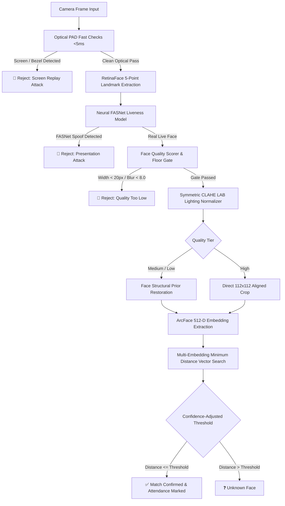

# 

<div align="center">

# PresenceX
### AI-Powered Multi-Face Attendance & Real-World CCTV Recognition Engine

[](https://nextjs.org/)
[](https://www.typescriptlang.org/)
[](https://fastapi.tiangolo.com/)
[]()
[]()
[]()

**PresenceX** is an enterprise-grade AI face-recognition attendance platform designed specifically for institutional and classroom environments. Engineered to excel on cheap 2MP analog/IP CCTV cameras, poor illumination, and long distances, it combines **Dual-Layer Anti-Spoofing**, **Symmetric CLAHE Lighting Normalization**, and **Multi-Frame Consensus Aggregation**.

[Live Demo](#-getting-started) • [Biometric Architecture](#-biometric-architecture) • [CCTV Hardening](#-real-world-cctv-hardening-part-6) • [Anti-Spoofing](#-dual-layer-presentation-attack-detection) • [API Reference](#-api-endpoints)

---

</div>

## 🧠 Biometric Architecture

PresenceX decouples **Liveness Verification** from **Identity Vector Matching**, ensuring that no attendance record is confirmed without first proving physical live presence in the current frame.



---

## 🛡️ Dual-Layer Presentation Attack Detection (PAD)

PresenceX uses a strict **"Belt-and-Suspenders"** dual-layered defense to block phone screen replays, printed photos, laptops, and tablet spoof attempts:

| Defense Layer | Technology / Model | Mechanism & Signals Detected |
| :--- | :--- | :--- |
| **Layer 1: Neural Network** | **DeepFace PyTorch FASNet** | Multi-scale texture frequency analysis classifying micro-skin texture vs print/screen pixels (`is_real`, `antispoof_score`). |
| **Layer 2: Optical Heuristics** | **OpenCV Spatial & Spectral PAD** | • **2D FFT Moiré Pattern Analysis**: Screen subpixel refresh grids.<br>• **Specular Glass Glare**: High-intensity light streaks on phone glass.<br>• **Bezel Contour Aspect Ratios**: Phone/tablet border detection.<br>• **Emissive Saturation Clipping**: Blown-out display panel LEDs. |

> **Security Rule**: If **EITHER** Layer 1 flags spoof **OR** Layer 2 flags optical replay, vector matching is stopped and attendance is blocked.

---

## 🎥 Real-World CCTV Hardening (Part 6 Pipeline)

Institutions in India and emerging markets predominantly deploy budget 2MP analog/IP CCTV cameras mounted at 10–25 feet with harsh tube lighting or backlit doorways. PresenceX incorporates dedicated real-world preprocessing:

1. **Quality Gate Floor**:
   - Rejects unrecognizable blobs where `face_width < 20px`, `blur_variance < 8.0`, or `|yaw| > 55.0°`. The system never guesses on invalid data.
2. **Symmetric CLAHE Lighting Normalization**:
   - Applied to the L-channel in LAB space with dynamic gamma correction, applied identically during enrollment and verification to eliminate dark/light mode discrepancies.
3. **Face-Specific Structural Restoration**:
   - Reconstructs facial boundaries using facial priors exclusively on `MEDIUM` (48–84px) and `LOW` (20–48px) quality tiers without hallucinating foreign features.
4. **Dynamic Confidence-Adjusted Thresholds**:
   - Automatically tightens the acceptance threshold for degraded footage (`HIGH: 0.6800`, `MEDIUM: 0.6460`, `LOW: 0.6120`).
5. **Multi-Frame Rolling Consensus**:
   - Aggregates 3–5 consecutive CCTV frames with majority voting ($\ge 60\%$) to eliminate transient motion-blur false positives.

---

## 👥 Multi-Embedding Enrollment & Minimum-Distance Matching

To eliminate "registered in light mode, fails in dark mode" sensitivity:
- Each student/person can have **3–5 varied reference embeddings** stored in the database (ambient room light, angled, and dim lighting).
- At identification time, the incoming embedding is compared against **all stored embeddings** for each person:
  $$\text{distance}_{\text{person}} = \min_{e \in \text{Embeddings}_{\text{person}}} (\text{CosineDistance}(\mathbf{u}, e))$$
- Taking the minimum distance across the enrollment pool dramatically improves true-positive rates while keeping thresholds strict against impostors.

---

## 🚀 Getting Started

### 1. Prerequisites
- **Node.js** v18+ and `npm`
- **Python** 3.10 – 3.13 with `venv`
- **SQLite3** / **PostgreSQL (Supabase)**

### 2. Python Face Engine Setup
```bash
cd presencex-face-engine
python3 -m venv venv
source venv/bin/activate
pip install -r requirements.txt
uvicorn app.main:app --port 8001
```

### 3. Next.js Frontend & API Setup
```bash
cd PresenceX-live
npm install
npm run dev -p 3000
```
Visit [http://localhost:3000/admin/face-test](http://localhost:3000/admin/face-test) for the interactive Face Test Lab.

---

## 📡 API Endpoints

| Endpoint | Method | Description |
| :--- | :--- | :--- |
| `/api/face/identify` | `POST` | Single-Face 1:N Identification with dual-layer PAD & quality analysis. |
| `/api/face/identify-multi` | `POST` | Multi-Face Batch 1:N CCTV vector search across all people in frame. |
| `/api/face/register` | `POST` | Multi-Embedding enrollment with symmetric CLAHE normalization. |
| `/api/face/list` | `GET` | List all registered enrolled students/personnel. |
| `/api/face/delete/{person_id}` | `DELETE` | Remove a registered profile and all associated biometric embeddings. |
| `/api/session/start` | `POST` | Create an active classroom attendance session. |
| `/api/attendance/mark` | `POST` | Confirm attendance record linked to verified live session. |

---

## 📜 Deployment & Camera Guidelines

Refer to [`CAMERA_GUIDELINES.md`](file:///home/mohitraj8503/Documents/presencex-face-engine/CAMERA_GUIDELINES.md) for hardware selection, optical placement heights (5.2–5.8 ft), illumination standards (300–500 lux), and angle avoidance recommendations.

---

<div align="center">
  <b>PresenceX</b> — Built with ❤️ for Real-World Physical Classrooms & Institutions.
</div>
