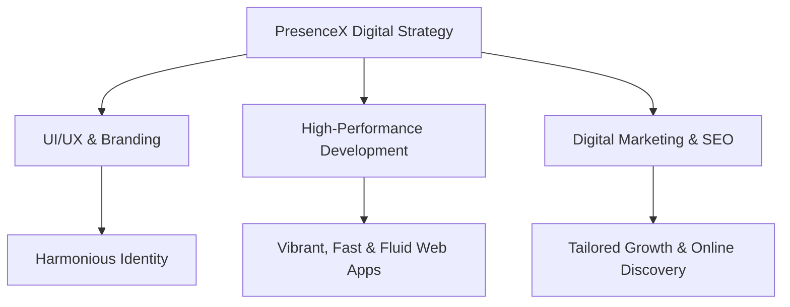

# 

<div align="center">

# PresenceX
### Presence, Not Clicks.

[](https://nextjs.org/)
[](https://www.typescriptlang.org/)
[](https://developer.mozilla.org/en-US/docs/Web/CSS)
[]()

**PresenceX** is a premier, modern agency platform delivering end-to-end digital solutions tailored to help businesses scale and dominate online. From high-fidelity UI/UX design to modern web architectures, we build immersive digital experiences.

[Explore Platform](#-key-features) • [Tech Stack](#-technology-stack) • [Getting Started](#%EF%B8%8F-getting-started) • [Deployment](#-deployment)

---

</div>

## ✨ End-to-End Digital Solutions

PresenceX delivers customized digital products that combine beautiful form with high-performance function. We specialize in turning vision into high-converting digital assets.



---

## 🚀 Key Features

*   **Premium Visual Aesthetics**: Sleek dark modes, glassmorphism, responsive animations, and harmonized color palettes tailored to catch the eye instantly.
*   **Fluid Motion Design**: Rich and interactive micro-animations powered by GSAP and custom scroll-driven reveals to elevate user engagement.
*   **Modern Typography & Layouts**: Built using modern fonts (Inter, Outfit) and cutting-edge CSS layouts (`:has()`, container queries, grid layouts) for a responsive and alive feel.
*   **End-to-End Agency Focus**: Pre-built sections showcasing UI/UX strategy, branding, digital marketing, web design, and SEO optimization.
*   **Highly Performant**: Fully optimized for Core Web Vitals (LCP, INP) to ensure instant page load times and search engine readiness.

---

## 🛠️ Technology Stack

| Layer | Technology | Description |
| :--- | :--- | :--- |
| **Core Framework** | [Next.js 15](https://nextjs.org/) | React-based server-side rendering, routing, and optimization. |
| **Language** | [TypeScript](https://www.typescriptlang.org/) | Type safety and enhanced developer tooling. |
| **Animations** | [GSAP](https://greensock.com/gsap/) & CSS | Premium micro-animations and smooth scroll-driven reveals. |
| **Styling** | Vanilla CSS | Custom, flexible styling tokens designed for premium layout transitions. |
| **Deployment** | Firebase App Hosting / Vercel | Seamless, secure hosting for high-traffic environments. |

---

## 📂 Directory Structure

```bash
PresenceX-live/
├── app/                  # Next.js App Router (pages & layout)
├── components/           # Reusable UI components
├── public/               # Static assets & branding assets
│   ├── images/           # Curated UI assets and branding screenshots
│   └── js/               # Optimized scripting modules
├── presencex/            # Core configuration & assets
├── next.config.ts        # Next.js optimization configuration
└── tsconfig.json         # TypeScript rules
```

---

## ⚙️ Getting Started

Follow these steps to run PresenceX locally:

### 1. Prerequisites
Ensure you have [Node.js](https://nodejs.org/) (v18.x or later) and `npm` installed.

### 2. Installation
Clone the repository and install all dependencies:
```bash
git clone https://github.com/mohitraj8503/PresenceX-live.git
cd PresenceX-live
npm install
```

### 3. Run Development Server
Start the Next.js local development server:
```bash
npm run dev
```
Open [http://localhost:3000](http://localhost:3000) in your browser to interact with the portal.

### 4. Production Build
To create an optimized production build:
```bash
npm run build
npm run start
```

---

## 🌐 Deployment

PresenceX can be deployed to any modern cloud server or serverless hosting platform.

### Deploying with Firebase App Hosting
```bash
# Install Firebase CLI
npm install -g firebase-tools

# Login to your Firebase account
firebase login

# Initialize App Hosting
firebase apphosting:backends:create --project <your-project-id>
```

---

## ❓ Frequently Asked Questions (FAQ)

#### Q: What services does PresenceX provide?
**A:** PresenceX provides end-to-end digital solutions, including web design, development, branding, digital marketing, UI/UX strategy, and SEO optimization.

#### Q: How is the performance optimized?
**A:** The platform is built on Next.js 15 using standard optimization techniques such as dynamic font loading, lazy-loaded components, optimized image layouts, and minimized client-side scripting modules.

#### Q: Can I customize the design tokens?
**A:** Yes. The application uses a central CSS setup allowing you to quickly modify colors, fonts, and spacing tokens in `index.css` to match your client's custom branding.

---

<div align="center">
    Made with ❤️ by PresenceX Team
</div>
