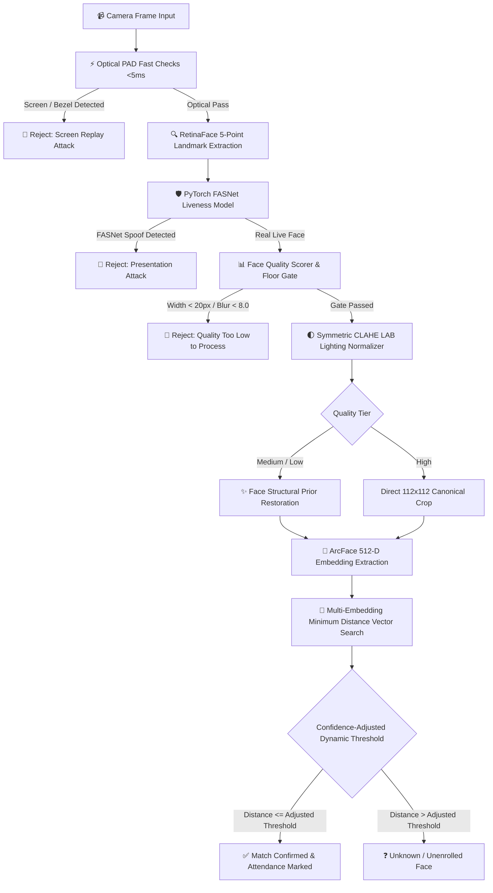

# 

<div align="center">

# PresenceX
### AI-Powered Multi-Face Attendance & Real-World CCTV Recognition Engine — Built for Real Indian Classrooms

*No more manual roll calls. No more proxy attendance. Just walk in, and you're marked present.*

[](https://nextjs.org/)
[](https://fastapi.tiangolo.com/)
[](https://github.com/serengil/deepface)
[]()
[]()
[]()

**PresenceX** is an enterprise-grade biometric attendance and classroom CCTV analytics platform. Engineered specifically to excel under challenging physical constraints—cheap 2MP analog/IP CCTV cameras, long distances (10–25 ft), harsh backlighting, and mobile screen spoofing—it pairs a **Next.js 16 full-stack frontend** with a **FastAPI / DeepFace AI microservice**.

[What is PresenceX?](#-what-is-presencex-in-one-line) • [The Real Problem](#-why-does-this-exist-the-real-problem) • [Biometric Flowchart](#-biometric-architecture-flowchart) • [Hard Problems Solved](#-the-hard-engineering-problems-presencex-solves) • [CCTV Hardening](#-part-6-real-world-cctv-hardening-pipeline) • [Dual-Layer PAD](#-dual-layer-presentation-attack-detection-anti-spoofing) • [API Reference](#-api-endpoints) • [Quick Start](#%EF%B8%8F-getting-started-running-it-yourself)

---

</div>

## 💡 What is PresenceX, in one line?

> **PresenceX marks student and staff attendance automatically by recognizing their faces through a camera — no fingerprint queues, no RFID cards, and zero manual roll calls.**

Someone walks past a kiosk camera near the doorway or enters a classroom monitored by CCTV: the system verifies their live physical presence in under 2 seconds and securely records their attendance in real time.

---

## 🎯 Why does this exist? (The Real Problem)

Traditional attendance systems in colleges and schools suffer from systemic inefficiencies:

1. **Wasted Academic Time**: Calling out 60+ names individually every single lecture consumes 10–15% of actual teaching time.
2. **Rampant Proxy Attendance**: Students easily call out "present" for absent peers or share RFID keycards.
3. **Fragile Hardware**: Optical fingerprint scanners regularly fail in Indian summer heat due to sweat, dust, and smudges, creating long hallway bottlenecks.
4. **Paper Record Chaos**: Physical attendance registers get misplaced, altered, or require exhausting manual tallying at the end of the semester.

**PresenceX solves this at the root**: *Your live face is your biometric card, and it cannot be handed to a friend.*

---

## 🧠 Biometric Architecture Flowchart

PresenceX decouples **Liveness Verification (Anti-Spoofing)** from **Identity Vector Matching**, ensuring that no attendance record is confirmed without first proving physical live presence in the current frame.



---

## 🔍 How It Works (In 3 Simple Stages)

### 📌 Stage 1 — Enrollment (Done Once Per Person)
An administrator registers a student or staff member **once**: capturing their name, roll number, role, and 3–5 multi-angle / multi-lighting photos. The system processes these images through symmetric CLAHE normalization, extracts unique 512-dimensional mathematical vectors (**Face Embeddings**), and stores them securely in the database.

### 📌 Stage 2 — Live Recognition (Every Active Session)
When a person walks in front of the camera:
1. **Detection & Alignment**: RetinaFace localizes the face and aligns eye/nose/mouth landmarks to a canonical 112×112 geometry.
2. **Dual-Layer Anti-Spoofing**: Inspects the frame for optical screen artifacts (moiré, glare, bezels) and neural micro-textures.
3. **Quality & Lighting Normalization**: Evaluates blur/contrast, applies CLAHE equalization, and restores low-resolution crops.
4. **Vector Search**: Compares the live embedding against all enrolled profiles using vectorized Cosine Distance:
   $$\text{distance} = 1.0 - \frac{\mathbf{u} \cdot \mathbf{v}}{\|\mathbf{u}\|_2 \|\mathbf{v}\|_2}$$
5. **Instant Attendance Confirmation**: If the best distance satisfies the dynamic threshold, attendance is confirmed in `< 2.0s`.

### 📌 Stage 3 — Live Reporting & Analytics
Faculty and admins access real-time dashboards displaying session summaries, attendance percentages, timestamps, and confidence metrics—turning paper registers into searchable digital logs.

---

## 🛡️ Dual-Layer Presentation Attack Detection (Anti-Spoofing)

PresenceX enforces a **"Belt-and-Suspenders"** dual-layered defense to block phone screen replays, printed photos, laptops, and tablet spoof attempts:

```text
                             CAMERA INPUT FRAME
                                     │
                    ┌────────────────┴────────────────┐
                    ▼                                 ▼
       [LAYER 1: Neural Network PAD]       [LAYER 2: Optical Cues PAD]
        • PyTorch FASNet Architecture       • 2D FFT Moiré Frequency Grids
        • Micro-texture Skin Classification • Glass Specular Reflection / Glare
        • Returns: is_real & score          • Bezel Geometry & Aspect Ratios
                    └────────────────┬────────────────┘
                                     │
                          [DUAL-LAYER GATE POLICY]
               If (FASNet == SPOOF) OR (Optical PAD == SPOOF):
                                     │
                                     ▼
                   🛑 REJECT IMMEDIATELY (NO ATTENDANCE)
```

| Defense Layer | Technology / Model | Mechanism & Signals Detected |
| :--- | :--- | :--- |
| **Layer 1: Neural Network** | **DeepFace PyTorch FASNet** | Multi-scale texture frequency analysis classifying micro-skin texture vs print/screen pixels (`is_real`, `antispoof_score`). |
| **Layer 2: Optical Heuristics** | **OpenCV Spatial & Spectral PAD** | • **2D FFT Moiré Analysis**: Screen subpixel refresh grids.<br>• **Specular Glass Glare**: High-intensity light streaks on phone glass.<br>• **Bezel Contour Aspect Ratios**: Phone/tablet border detection.<br>• **Emissive Saturation Clipping**: Blown-out display panel LEDs. |

---

## 🎥 Part 6: Real-World CCTV Hardening Pipeline

Standard face recognition models assume high-resolution, frontally-lit studio portraits. In real Indian institutions, cameras are often budget 2MP sensors mounted at 15–25 feet with harsh tube lighting or backlit doorways. PresenceX addresses this with five dedicated pipeline stages:

1. **Quality Gate Floor**:
   - Rejects unrecognizable noise where `face_width < 20px`, `blur_variance < 8.0`, or `|yaw| > 55.0°`. The system never guesses on invalid data.
2. **Symmetric CLAHE Lighting Normalization**:
   - Equalizes the L-channel in LAB color space combined with adaptive gamma correction ($\gamma = 1.3 - 2.0$), ensuring identical illumination profiles during both enrollment and identification.
3. **Face-Specific Structural Prior Restoration**:
   - Uses bilateral filtering and unsharp high-frequency enhancement exclusively on `MEDIUM` (48–84px) and `LOW` (20–48px) quality tiers to recover authentic facial boundaries without hallucinating foreign features.
4. **Dynamic Confidence-Adjusted Thresholds**:
   - Automatically tightens the acceptance threshold for degraded footage to prevent false positives:
     - `HIGH Tier`: Threshold = `0.6800` (Base)
     - `MEDIUM Tier`: Threshold = `0.6460` ($0.68 \times 0.95$)
     - `LOW Tier`: Threshold = `0.6120` ($0.68 \times 0.90$)
5. **Multi-Frame Rolling Consensus Aggregation**:
   - For continuous CCTV feeds, aggregates 3–5 consecutive frames with majority consensus ($\ge 60\%$) to eliminate single-frame motion blur false matches.

---

## 👥 Multi-Embedding Enrollment & Minimum-Distance Matching

To eliminate "registered in light mode, fails in dark mode" sensitivity:
- Each person can have **3–5 varied reference embeddings** stored in the database (ambient room light, angled, and dim lighting).
- At identification time, the incoming embedding is compared against **all stored embeddings** for each person:
  $$\text{distance}_{\text{person}} = \min_{e \in \text{Embeddings}_{\text{person}}} (\text{CosineDistance}(\mathbf{u}, e))$$
- Taking the minimum distance across the enrollment pool dramatically improves true-positive rates while keeping thresholds strict against impostors.

---

## 🏗️ System Architecture & Data Flow

```text
┌──────────────────────────────────────────────────┐         ┌──────────────────────────────────────────────────┐
│             PresenceX-live (Next.js 16)          │  HTTP   │           presencex-face-engine (FastAPI)        │
│          (Web Application & Client Portal)       │ ──────► │          (Python AI Biometrics Microservice)     │
│                                                  │ ◄────── │                                                  │
│  • App Router (React 19 & TypeScript)            │  JSON   │  • RetinaFace Landmark Detector                  │
│  • Single-Face Kiosk & Multi-Face CCTV Lab UI    │         │  • ArcFace 512-D Biometric Embedding Generator   │
│  • Live Attendance Reports & Admin Dashboard     │         │  • Dual-Layer FASNet + Optical Anti-Spoofing     │
│  • Edge Middleware & Session Management          │         │  • Adaptive CLAHE Normalization & Restoration    │
│  • Client Camera Canvas Optimization             │         │  • SQLite / PostgreSQL Biometric Vector Storage  │
└──────────────────────────────────────────────────┘         └──────────────────────────────────────────────────┘
```

---

## 🛠️ Technology Stack

| Layer | Technology | Purpose & Description |
| :--- | :--- | :--- |
| **Frontend Framework** | [Next.js 16](https://nextjs.org/) (App Router) | React 19, TypeScript, Server-Side Rendering, Turbopack. |
| **Styling & Design** | Vanilla CSS + Design Tokens | Curated typography, glassmorphism, responsive grid layouts. |
| **AI Backend Service** | [FastAPI](https://fastapi.tiangolo.com/) (Python 3.13) | Asynchronous high-performance REST API microservice. |
| **Face Recognition** | DeepFace + ArcFace (512-D) | State-of-the-art cosine distance angular margin loss vector matching. |
| **Face Detection** | RetinaFace | 5-point facial landmark alignment (eyes, nose, mouth). |
| **Liveness & PAD** | PyTorch FASNet + OpenCV Spectral | Dual-layer presentation attack detection against photos/screens. |
| **Database** | SQLite / Supabase PostgreSQL | Encrypted relational storage for profiles, embeddings, and logs. |
| **Animations** | GSAP (GreenSock) | Smooth UI transitions, status badges, and interactive feedback. |

---

## 📡 API Endpoints

| Endpoint | Method | Description |
| :--- | :--- | :--- |
| `/api/face/identify` | `POST` | Single-Face 1:N Identification with dual-layer PAD & quality analysis. |
| `/api/face/identify-multi` | `POST` | Multi-Face Batch 1:N CCTV vector search across all people in frame. |
| `/api/face/register` | `POST` | Multi-Embedding enrollment with symmetric CLAHE normalization. |
| `/api/face/list` | `GET` | List all registered enrolled students/personnel. |
| `/api/face/delete/{person_id}` | `DELETE` | Remove a registered profile and all associated biometric embeddings. |
| `/api/session/start` | `POST` | Create an active classroom attendance session. |
| `/api/attendance/mark` | `POST` | Confirm attendance record linked to verified live session. |

---

## ⚙️ Getting Started (Running It Yourself)

### Prerequisites
- **Node.js** v18.x or later, and `npm`
- **Python** 3.10 – 3.13 with `venv`
- A standard USB / built-in webcam or IP camera feed

### 1. Clone & Set Up the Next.js Frontend
```bash
git clone https://github.com/mohitraj8503/PresenceX-live.git
cd PresenceX-live
npm install
```

### 2. Set Up the Python AI Face Engine
```bash
cd ../presencex-face-engine
python3 -m venv venv
source venv/bin/activate   # Windows: venv\Scripts\activate
pip install -r requirements.txt
uvicorn app.main:app --port 8001
```

### 3. Configure Environment Variables
Create a `.env.local` file in `PresenceX-live/`:
```env
FACE_ENGINE_URL=http://127.0.0.1:8001
```

### 4. Run the Platform
```bash
cd PresenceX-live
npm run dev
```
Open [http://localhost:3000](http://localhost:3000) in your browser:
- `/admin/register` — Enroll a new face
- `/kiosk` — Single-face walk-up kiosk screen
- `/admin/face-test` — Single-face & Multi-face CCTV interactive test lab
- `/admin/dashboard` — Live attendance reports and logs

---

## 🔒 Privacy & Biometric Security

- **No Raw Photo Retention**: PresenceX extracts and stores mathematical 512-dimensional vector arrays (`face_embedding`), not raw unencrypted photos.
- **Server-Authoritative Decisions**: All attendance decisions, liveness checks, and timestamps are validated server-side to prevent client spoofing.
- **Hardware Guidelines**: See [`CAMERA_GUIDELINES.md`](file:///home/mohitraj8503/Documents/presencex-face-engine/CAMERA_GUIDELINES.md) for optical height mounting (5.2–5.8 ft) and lighting standards (300–500 lux).

---

<div align="center">

**PresenceX** — Because attendance should be automatic, honest, and instant.

Built with ❤️ by [Mohit Raj](https://github.com/mohitraj8503)

</div>
